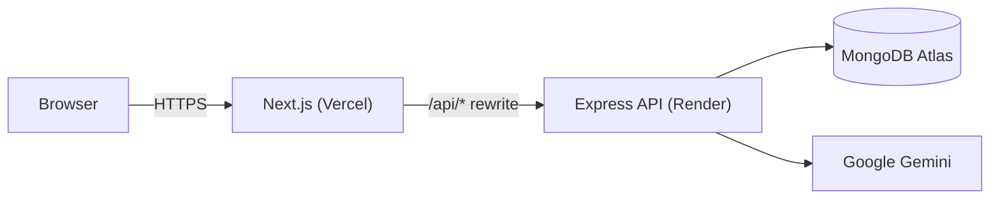

# AI Travel Planner

A multi-user, AI-powered trip planner. Give it a departure(origin) and destination locations, a number of
days, a budget level, and some interests — it generates a complete
day-by-day itinerary, a budget breakdown, hotel picks, and an AI risk &
safety assessment, all editable afterward (add/remove/reorder/regenerate,
with undo).

Built as a full-stack engineering assessment, on top of an existing
scaffolded backend, delivered in 8 phases over one continuous session.

## Contents

- [Live deployment](https://ai-travel-planner-gamma-brown.vercel.app/)
- [Tech stack](#tech-stack)
- [Setup](#setup)
- [Architecture](#architecture)
- [Authentication & authorization](#authentication--authorization)
- [AI agent design](#ai-agent-design)
- [Custom feature: AI Risk & Safety Advisor](#custom-feature-ai-risk--safety-advisor)
- [Key design decisions & trade-offs](#key-design-decisions--trade-offs)
- [Known limitations](#known-limitations)
- [Testing](#testing)
- [API reference](#api-reference)
- [Screenshots](#screenshots)

## Live deployment

| | URL |
|---|---|
| Frontend | https://ai-travel-planner-gamma-brown.vercel.app/ |
| Backend health check | https://ai-travel-planner-bvbt.onrender.com/health |

Not deployed by this session — see [`docs/deployment/README.md`](docs/deployment/README.md)
for the full Vercel + Render + Atlas runbook. Deployment requires accounts
this session doesn't have access to; everything needed to deploy in ~15
minutes is prepared and verified (Dockerfiles were built and the full
stack was run end-to-end locally via `docker compose`).

## Tech stack

| Layer | Choice | Why |
|---|---|---|
| Frontend | Next.js 16 (App Router), TypeScript, Tailwind CSS v4 | Matches the assessment's preferred stack. Next.js resolved to v16 (the actual latest at build time, not 15 — App Router usage is unaffected) |
| UI | shadcn/ui, [Base UI](https://base-ui.com) primitives, Framer Motion | shadcn's CLI now scaffolds on Base UI (the Radix team's newer primitive library) instead of Radix by default — used as generated rather than pinning back to an older stack |
| Forms/state | React Hook Form, Zod, TanStack Query, Zustand, Axios | As specified — RHF+Zod for forms, TanStack Query for server state/caching, Zustand for the one piece of real client state (auth), Axios with interceptors for the refresh-token flow |
| Drag & drop | `@dnd-kit` | Activity reordering within a day |
| Backend | Node.js, Express 5, TypeScript | As specified |
| Database | MongoDB (Atlas in production, in-memory for tests), Mongoose | As specified |
| Auth | JWT (access + refresh), bcrypt, httpOnly cookies | See [Authentication & authorization](#authentication--authorization) |
| AI | **Google Gemini** (`@google/genai`), `gemini-3.1-flash-lite` | The brief suggested OpenAI GPT-4.1; built against Gemini instead per an explicit decision made mid-project — see [Key design decisions](#key-design-decisions--trade-offs) |
| Validation/security | Zod (both ends), Helmet, `express-rate-limit`, CORS | Backend never trusts frontend validation alone |
| Testing | Jest, Supertest, `mongodb-memory-server`, React Testing Library | See [Testing](#testing) |
| CI/CD | GitHub Actions, Docker, Render (backend), Vercel (frontend) | See [`docs/deployment`](docs/deployment/README.md) |

## Setup

### Prerequisites

- Node.js 22+
- A MongoDB connection string (local, Docker, or [Atlas](https://www.mongodb.com/atlas) free tier)
- A free [Gemini API key](https://aistudio.google.com/app/apikey) — **optional**, see below

### Local development

```bash
git clone https://github.com/MMALLIKARJUN2312/AI_Travel_Planner.git
cd AI_Travel_Planner

# Backend
cd backend
cp .env.example .env   # fill in MONGODB_URI, JWT secrets, optionally GEMINI_API_KEY
npm install
npm run dev             # http://localhost:5000

# Frontend (in a second terminal)
cd frontend
cp .env.example .env.local   # BACKEND_URL=http://localhost:5000
npm install
npm run dev             # http://localhost:3000
```

**No Gemini key yet?** Leave `GEMINI_API_KEY` blank. The backend auto-falls
back to a deterministic mock AI provider (`AI_PROVIDER=mock`) that returns
realistic, schema-valid itineraries instantly — the whole app works
end-to-end without ever calling a real LLM. This is also what the test
suite runs on, so `npm test` never makes a real API call.

### With Docker

```bash
docker compose up --build
```

Spins up MongoDB, backend, and frontend together (frontend on `:3000`,
backend on `:5000`). See [`docs/deployment/README.md`](docs/deployment/README.md#local-development-with-docker-compose)
for details on how this differs from `npm run dev` (uses a containerized
Mongo, not your `.env`'s Atlas URI).

### Deployed

Full step-by-step guide (Atlas → Render → Vercel, including the one
non-obvious setting each platform needs) in
[`docs/deployment/README.md`](docs/deployment/README.md).

## Architecture



Clean layered backend (`routes → controller → service → repository →
model`) split into `auth` / `users` / `trips` / `ai` modules — the `ai`
module knows nothing about Express or Mongoose, so "how we talk to an LLM"
stays fully decoupled from "how a trip is persisted." Full diagrams
(sequence diagrams for AI generation and the auth flow, folder-by-folder
breakdown of both apps) in [`docs/architecture/README.md`](docs/architecture/README.md).
Database schema and entity relationships in [`docs/database/README.md`](docs/database/README.md).

### Folder structure

```
AI_Travel_Planner/
├── backend/
│   └── src/
│       ├── config/ core/ middlewares/     # cross-cutting concerns
│       └── modules/{auth,users,trips,ai}/   # controllers/services/repositories/schemas/routes
├── frontend/
│   ├── app/                                # Next.js App Router pages
│   ├── components/{ui,auth,trips,app-shell,marketing}/
│   ├── hooks/ services/ store/ lib/ types/
├── docs/{architecture,database,api,deployment}/
├── docker-compose.yml, render.yaml
└── .github/workflows/ci.yml
```

## Authentication & authorization

- **Access token**: short-lived (15 min) JWT, returned in the response body
  on register/login, sent by the frontend as `Authorization: Bearer <token>`,
  held in memory + persisted via Zustand (`localStorage`) so a page refresh
  doesn't force a re-login.
- **Refresh token**: longer-lived (7 days) JWT in an `httpOnly`,
  `SameSite=strict` cookie — never readable by JavaScript. Rotated on every
  use (old token invalidated, new one issued), not just reused, so a leaked
  refresh token has a short window of usefulness. Stored server-side per
  user, so logout can revoke it and a user can hold multiple valid sessions
  (e.g. two browser tabs) independently.
- **Silent refresh**: an axios response interceptor catches `401`s, calls
  `/api/auth/refresh` once (the cookie is sent automatically), retries the
  original request with the new access token, and only redirects to
  `/login` if the refresh itself fails.
- **Authorization / data isolation**: every trip query in the backend is
  scoped by `{ _id: tripId, userId: req.user.userId }` at the repository
  layer — there's no code path that fetches a trip by id alone. A request
  for another user's trip returns `404`, not `403`, so it doesn't even leak
  *that* the trip exists. Verified explicitly in the integration test suite
  (`trip.routes.test.ts`) and manually at the end of every phase during
  development.
- **Passwords**: bcrypt, 12 salt rounds, `select: false` on the schema field
  so a `User` is never accidentally returned with its hash.

Why split tokens like this instead of one long-lived token, or Redis-backed
sessions? A single long-lived JWT can't be revoked before it expires; a
pure session store adds infrastructure (Redis) for a feature (multi-device
sessions) the refresh-rotation approach already gives for free. The
trade-off is complexity — two token types, a rotation dance, a proxy layer
to make the cookie work cross-domain (below) — accepted deliberately.

## AI agent design

`backend/src/modules/ai/` is a small, self-contained layer:

- **`providers/`** — an `AiProvider` interface (`generateContent(prompt):
  Promise<string>`) with two implementations: `GeminiProvider` (real calls,
  JSON response mode, 45s timeout) and `MockProvider` (parses labelled
  fields out of the prompt text and returns deterministic, realistic JSON —
  used whenever no API key is configured, and always in tests).
- **`prompts/`** — one builder function per operation (full itinerary,
  regenerate one day, regenerate one activity, refresh hotels), each
  pinning an exact JSON shape and explicitly forbidding markdown/prose in
  the response.
- **`schemas/`** — Zod schemas that mirror the Mongoose sub-schemas
  field-for-field, so a validated AI response can be persisted directly
  with no transformation step.
- **`services/itinerary-ai.service.ts`** — the one interesting piece: a
  shared `generateStructured<T>(prompt, schema, maxRetries=2)` helper used
  by every AI operation. It calls the provider, strips markdown code fences
  defensively, `JSON.parse`s, validates with `schema.safeParse`, and on any
  failure (network error, malformed JSON, or schema-invalid JSON) retries
  with the specific error appended to the prompt — "your previous response
  was invalid: X, return corrected JSON only." After the retry budget is
  exhausted it throws a typed `502 AppError` instead of ever handing a
  broken shape to the database or the client.

This retry loop is the most heavily unit-tested piece of the backend
(`tests/unit/itinerary-ai.service.test.ts`) — it's exercised with a
scriptable stub provider covering first-try success, recovery after
malformed JSON, recovery after schema-invalid JSON, code-fence stripping,
exhausting all retries, and an `AppError` short-circuiting retries entirely
(a provider-level failure like "service unavailable" shouldn't be retried
the same way a parse failure should).

`TripService` is the only consumer of `ItineraryAiService`; it never talks
to the AI provider or builds a prompt directly.

## Custom feature: AI Risk & Safety Advisor

Every generated trip includes an AI-produced risk assessment: a 0–100 risk
score, a `LOW`/`MEDIUM`/`HIGH` level, destination-specific safety
recommendations, and a list of indoor/low-risk alternative activities.

**Why this instead of the other listed options** (packing list, chat
assistant, expense tracker, etc.): the existing scaffolded backend already
had an unused `riskAssessment` sub-schema on the `Trip` model from an
earlier planning pass. Building it out — rather than introducing an
unrelated concept — meant the feature could go deeper than a bolt-on: it's
integrated into the itinerary itself, not a separate page.

**What makes it more than a static card**: each suggested alternative
activity has a **"Swap in"** action. Click it, pick which day / time slot /
existing activity to replace, and it calls the AI to regenerate that
specific activity using the suggestion as the instruction — turning a
passive list of text suggestions into a one-click mitigation. Risk level is
also surfaced as a badge on every trip card and the itinerary header, so
it's visible before you even open a trip, not just buried in one card.

**The actual problem this solves**: a fixed itinerary is brittle — weather
changes, a venue closes, a neighborhood turns out to be best avoided at
night. Re-prompting an AI travel planner from scratch to handle that is
slow and loses the rest of the trip's context. Surfacing destination-aware
risk information *at itinerary-generation time*, with a direct path from
"here's a safer alternative" to "it's now in my itinerary," addresses that
without leaving the page or losing anything else in the plan.

## Key design decisions & trade-offs

- **Gemini over OpenAI.** The brief specified OpenAI GPT-4.1; the project
  was built against Google Gemini instead, per an explicit decision made
  early on. The `AiProvider` interface exists specifically so this isn't a
  deep coupling — swapping in an `OpenAiProvider` later is a new file and a
  factory branch, not a rewrite.
- **Same-origin API proxy, not a public API URL.** The backend's refresh
  cookie is `SameSite=strict`. Two genuinely different production domains
  (`*.vercel.app`, `*.onrender.com`) would never exchange that cookie, which
  would silently break session refresh in production while working
  perfectly in local dev (same-site there). `next.config.ts` proxies
  `/api/*` through a server-side rewrite so the browser only ever sees one
  origin. This was designed in deliberately during Phase 2, not discovered
  as a bug later — see [`docs/deployment/README.md`](docs/deployment/README.md#why-backend_url-and-not-a-public-api-url).
- **Client-side pagination/search/sort for trip history**, not server-side
  query params. The backend has no `?page=`/`?search=` support on
  `GET /api/trips` — the frontend fetches all of a user's trips and
  filters/sorts/paginates in memory. Reasonable for what's realistically a
  personal trip list (tens, not thousands, of trips); would need revisiting
  if usage patterns turned out otherwise.
- **Manual (non-AI) add/remove vs. AI regenerate**, kept as separate
  endpoints and separate UI actions rather than funneled through one "edit
  activity" flow. Adding a specific activity you already have in mind
  shouldn't cost an AI call and 10–30s of latency; regenerating something
  you're unsure about should. Undo is implemented per-operation (re-add the
  removed activity's exact data; restore a day's prior snapshot) rather
  than a generic undo stack, which is simpler and sufficient for the actual
  edit operations available.
- **Embedded sub-documents, not separate collections**, for a trip's
  itinerary/budget/hotels/risk data (see [`docs/database`](docs/database/README.md)).
  It's always read and written as a unit with the trip, so embedding avoids
  joins for no benefit — the trade-off is a trip document can grow large
  for many-day trips, capped in practice by the 1–30 day validation range.
- **`mongodb-memory-server` for tests**, not a shared test database or
  heavy mocking of Mongoose. Gives real integration coverage (actual
  queries against actual Mongoose models) without touching Atlas or
  needing a database service in CI.

## Known limitations

- **No pagination/search on the backend** for trip history — see above.
- **`User.refreshTokens[].expiresAt`** is part of the schema but isn't
  currently populated when a token is issued, so stale refresh tokens
  aren't pruned automatically (rotation still invalidates old tokens on
  use — this only affects tokens that are *never* used again).
- **`POST /api/trips/:id/hotels/refresh`** is implemented, tested
  (integration test + verified live against Gemini), and documented, but
  has no button wired up in the UI yet — hotel suggestions are only
  refreshed as part of full trip generation.
- **No RTL tests for the Base UI–heavy components** (`Select`, `Dialog`,
  drag-and-drop). jsdom doesn't implement the browser APIs those need
  (`PointerEvent` capture, `ResizeObserver`, real portals); forcing it would
  produce brittle tests more than real coverage. Those flows were instead
  verified manually in a real browser during development.
- **No forgot-password flow.** Listed as a bonus in the brief; not built.
- **No role-based UI** — `UserRole.ADMIN` exists in the schema and is
  enforced by an `authorize()` middleware, but nothing in the app currently
  uses an admin role.
- **npm audit** flags 3 high-severity CVEs inside Next.js 16.2.12's own
  bundled `postcss`/`sharp` dependencies — no fix is available yet without
  downgrading Next.js by several major versions, so it wasn't forced.

## Testing

```bash
cd backend && npm test    # Jest + Supertest, mongodb-memory-server, mock AI provider
cd frontend && npm test   # Jest + React Testing Library
```

Backend: unit tests for password hashing, JWT sign/verify, and the AI
retry/validation loop (via a scriptable stub provider); integration tests
(real Express app, real — if ephemeral — MongoDB) for the full auth flow
and the full trip lifecycle including cross-user isolation. Frontend: Zod
schema validation, form rendering + validation-error + submit-payload
tests, and rendering tests for the budget breakdown and trip card. See
[Known limitations](#known-limitations) for what's intentionally not
covered by automated tests.

## API reference

Full endpoint table in [`docs/api/README.md`](docs/api/README.md). A
ready-to-run [Postman collection](docs/api/postman_collection.json) covers
every endpoint, auto-capturing the access token and chaining trip/activity
ids between requests — verified end-to-end with Newman against a live
local backend before being committed.

## Screenshots

_Add a few screenshots here before submitting — e.g. the dashboard, the
create-trip flow, a generated itinerary, and the risk advisor's "Swap in"
dialog._
