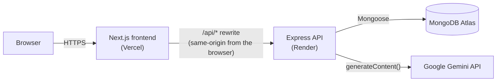
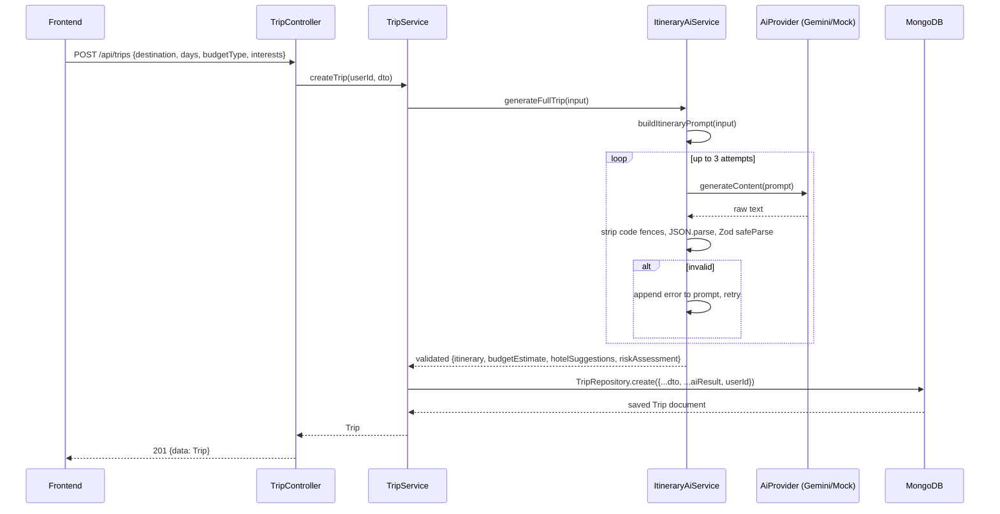
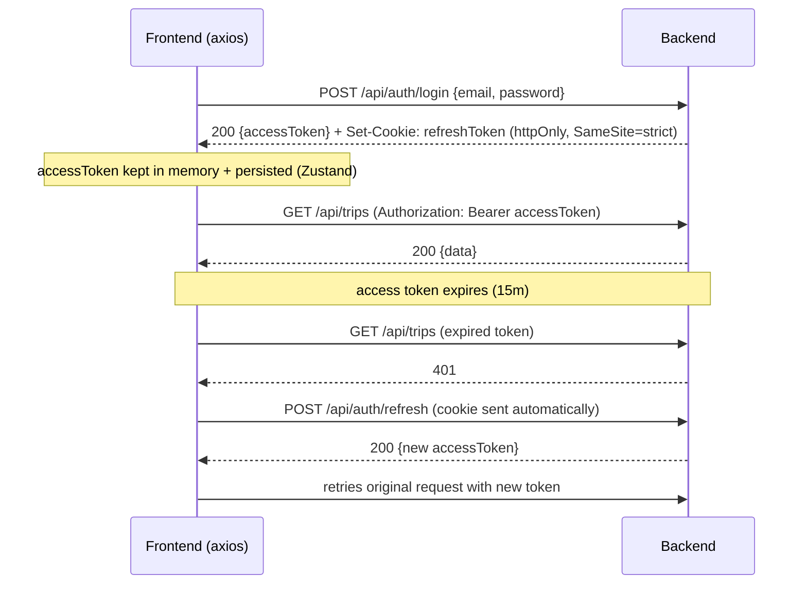

# Architecture

## System overview

Three independently deployable pieces: a Next.js frontend, an Express API,
and MongoDB Atlas. The frontend never talks to the backend or to Gemini
directly from the browser — everything server-side is proxied or called
from trusted server code.



The `/api/*` rewrite (`frontend/next.config.ts`) is not just routing
convenience. The backend's refresh token is an `httpOnly`, `SameSite=strict`
cookie — on two different production domains (`*.vercel.app` and
`*.onrender.com`) that cookie would never be attached to a cross-site
request. Proxying through the frontend's own server makes every API call
same-origin from the browser's point of view, so the cookie behaves
normally. See [`docs/deployment/README.md`](../deployment/README.md) for
more on this.

## Backend: modular, layered architecture

```
backend/src/
├── app.ts                    # Express app: middleware, route mounting
├── server.ts                 # Entry point: connects DB, starts listening
├── config/                   # env validation (Zod), Mongoose connection
├── core/
│   ├── errors/                # AppError, asyncHandler (wraps route handlers)
│   ├── logger/                 # Winston logger
│   └── responses/              # Shared API response type
├── middlewares/               # auth, role, validation, error, request-id
├── modules/
│   ├── auth/                   # register/login/refresh/logout
│   │   ├── controllers/ services/ repositories/ schemas/ routes/ types/
│   ├── users/                  # /me profile endpoint
│   ├── trips/                  # trip CRUD + itinerary editing
│   │   ├── models/               # Mongoose schemas (Trip + 4 sub-schemas)
│   │   ├── controllers/ services/ repositories/ schemas/ routes/ types/
│   └── ai/                     # AI provider abstraction + prompts
│       ├── providers/            # AiProvider interface, Gemini + mock impls
│       ├── prompts/               # prompt builders (one per AI operation)
│       ├── schemas/               # Zod schemas validating AI output
│       ├── services/              # ItineraryAiService (retry/validation loop)
│       └── types/                 # shared AI input types
└── tests/                     # unit + integration (Jest, Supertest)
```

Each module in `modules/` follows the same layering, always in this
direction — a layer only calls the one below it, never sideways or up:

`routes → controller → service → repository → Mongoose model`

- **Routes** wire up middleware order (`authMiddleware → validate(schema) →
  asyncHandler(controller.method)`) and nothing else.
- **Controllers** parse/validate the HTTP-shaped request, call exactly one
  service method, and shape the HTTP response. No business logic.
- **Services** hold business logic and orchestrate repositories/other
  services (e.g. `TripService.createTrip` calls `ItineraryAiService` then
  `TripRepository`).
- **Repositories** are the only layer that touches Mongoose models directly.

The `ai` module is deliberately separate from `trips` — it knows nothing
about Express, HTTP, or Mongoose. `TripService` is the only consumer of
`ItineraryAiService`, which keeps "how we talk to an LLM" fully decoupled
from "how a trip is persisted."

## AI itinerary generation flow



The same `generateStructured<T>()` retry loop (in `itinerary-ai.service.ts`)
backs every AI operation — full-trip generation, single-day regeneration,
single-activity regeneration, and hotel refresh — parameterized only by the
prompt and the Zod schema to validate against. This is the piece covered
most heavily in the test suite (`tests/unit/itinerary-ai.service.test.ts`),
since it's the one place a malformed LLM response could otherwise crash a
request.

## Authentication flow



See the root [README's Authentication & Authorization section](../../README.md#authentication--authorization)
for the reasoning behind this split (short-lived bearer token vs. httpOnly
refresh cookie) and how user-data isolation is enforced.

## Frontend structure

```
frontend/
├── app/                       # Next.js App Router
│   ├── (auth)/                  # /login, /register — guest-only route group
│   ├── (app)/                   # /dashboard, /trips, /trips/[id], /trips/new
│   │                             #   — auth-required route group
│   └── page.tsx                 # public landing page
├── components/
│   ├── ui/                      # shadcn/ui primitives (Base UI-backed)
│   ├── auth/                    # login/register forms, route guard
│   ├── app-shell/                # topbar, account menu
│   ├── marketing/                 # landing page pieces
│   └── trips/                    # itinerary, budget, hotels, risk advisor
├── hooks/                      # TanStack Query hooks (one per domain concern)
├── services/                   # thin axios wrappers per REST resource
├── store/                      # Zustand (auth state only)
├── lib/                        # axios instance, Zod schemas, small utils
└── types/                      # types mirroring backend response shapes
```

`services/*.service.ts` are the only files that know REST endpoint shapes;
`hooks/use-*.ts` wrap them in TanStack Query and own cache invalidation,
optimistic-undo snapshots, and toast feedback; components only ever import
hooks, never services directly. This keeps a request's HTTP contract in one
place — changing an endpoint touches one service function, not every
component that uses it.
