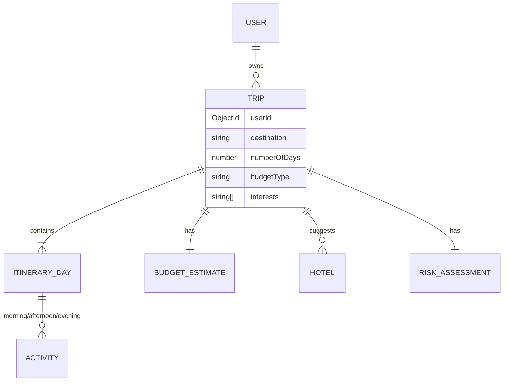

# Database Schema

MongoDB via Mongoose. Two top-level collections: `User` and `Trip`. A trip's
AI-generated content (itinerary, budget, hotels, risk assessment) is
embedded directly on the `Trip` document rather than split into separate
collections — it's always read and written as a unit with the trip, never
queried independently, so embedding avoids joins for no benefit.

## `User`

`backend/src/modules/users/models/user.model.ts`

| Field | Type | Notes |
|---|---|---|
| `name` | String | required, trimmed, 2–50 chars |
| `email` | String | required, trimmed, lowercased, **unique index** |
| `password` | String | required, bcrypt hash, `select: false` (never returned by default queries) |
| `role` | String enum | `USER` \| `ADMIN`, default `USER` |
| `refreshTokens` | `[{ token: String, expiresAt: Date }]` | active refresh tokens for this user (see note below) |
| `createdAt` / `updatedAt` | Date | via `timestamps: true` |

**Refresh token rotation**: on login/register a refresh token is pushed
into `refreshTokens`; on `/api/auth/refresh` the presented token is
replaced with a newly issued one (rotation, not reuse); on logout it's
pulled out. This allows a user to hold multiple valid sessions (e.g.
several browser tabs or devices) without them invalidating each other.

> **Known gap**: `expiresAt` is part of the schema but isn't currently
> populated when a token is added — stale entries in `refreshTokens` aren't
> pruned automatically. Noted in the root README's Known Limitations.

## `Trip`

`backend/src/modules/trips/models/trip.model.ts`

| Field | Type | Notes |
|---|---|---|
| `userId` | ObjectId → `User` | required, indexed (see below) |
| `destination` | String | required, trimmed |
| `numberOfDays` | Number | required, min 1 |
| `budgetType` | String | `BUDGET` \| `MID_RANGE` \| `LUXURY` |
| `interests` | `[String]` | e.g. `["Food", "Culture"]` |
| `itinerary` | `[ItineraryDay]` | one entry per day, see below |
| `budgetEstimate` | `BudgetEstimate` | single embedded object |
| `hotelSuggestions` | `[Hotel]` | AI-suggested hotels |
| `riskAssessment` | `RiskAssessment` | single embedded object — the custom feature's data |
| `createdAt` / `updatedAt` | Date | via `timestamps: true` |

Indexes: `{ userId: 1, createdAt: -1 }` (a user's trips, newest first — the
exact query `GET /api/trips` runs) and `{ destination: 1 }` (reserved for a
future cross-user "popular destinations" style query; not currently used by
any endpoint).

### Sub-schemas

**`ItineraryDay`** (`models/itinerary-day.schema.ts`) — has its own `_id`
(needed so individual days can be targeted by regenerate/restore endpoints):

| Field | Type |
|---|---|
| `dayNumber` | Number |
| `title` | String |
| `morning` / `afternoon` / `evening` | `[Activity]` |
| `tips` | `[String]` |
| `estimatedCost` | Number |

**`Activity`** (`models/activity.schema.ts`) — also has its own `_id`, since
individual activities are added/removed/regenerated/reordered by id:

| Field | Type |
|---|---|
| `title` | String |
| `description` | String |
| `duration` | String (free text, e.g. `"2 hours"`) |
| `estimatedCost` | Number |

**`BudgetEstimate`** (`models/budget-estimate.schema.ts`) — `_id: false`,
always a single object per trip:

| Field | Type |
|---|---|
| `flights` / `accommodation` / `food` / `transportation` / `activities` | Number |
| `total` | Number |
| `confidenceLevel` | Number, 0–1 |

**`Hotel`** (`models/hotel.schema.ts`) — `_id: false`:

| Field | Type |
|---|---|
| `name` | String |
| `rating` | Number, 0–5 |
| `priceRange` | String (e.g. `"$"`, `"$$"`, `"$$$"`) |
| `description` | String |

**`RiskAssessment`** (`models/risk-assessment.schema.ts`) — `_id: false`:

| Field | Type |
|---|---|
| `riskScore` | Number, 0–100 |
| `riskLevel` | String enum: `LOW` \| `MEDIUM` \| `HIGH` |
| `recommendations` | `[String]` |
| `alternativeActivities` | `[String]` — the suggestions surfaced by the "swap in" feature |

## Relationships

Every trip query in the app is scoped by `{ _id: tripId, userId }` at the
repository layer (`TripRepository`) — there is no code path that fetches a
trip by id alone, which is what makes cross-user data isolation structural
rather than something each controller has to remember to check.
